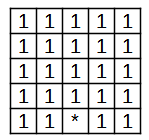
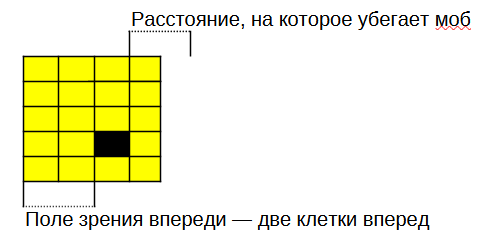

# Мобы во вселенной booblike - небольшой гайд.

Небольшая документация, охватывающая все, что нужно знать про эту игру.

## О персонаже

Персонажи определяют каждую отдельнуюю сущность на карте. Персонаж - часть класса персонажей.

Уровень персонажа равняется под то, на каком уровне был наш герой при входе на карту.

## Классы персонажей

Классы определяют основные свойства персонажей:

- характеристики и атрибуты;

- набор атак и возможное их количество;

- предысторию;

- стретегии поведения вместе с переходами в различные состояния.

На основе данных, представленных в классе, мы собираем информацию о каждом отдельном персонаже при его генерации на карте.

## Атрибуты персонажей.

На данный момент у персонажей есть 5 основных характеристик (в пределах уровня от 1 до 10):

- сила $S$ определяет силу атаки и уровень здоровья;

- восприятие $P$ определяет вероятность попасть по персонажу, а также поле зрения моба.

- выносливость $E$ определяет уровень здоровья, скорость его восстановления, а также защиту от урона;

- ловкость $A$ определяет вероятность отвернуться от атаки, а также скорость перемещения;

- интеллект $I$ определяет то, сколько очков можно получить за убийство одного моба, а также вероятность ударить по себе.

На основе этих характеристик (а также уровня персонажа $L$) идет расчет следующих атрибутов:

### Сила атаки

Сила атаки определяется силой. Вычисляется по формуле

$$
\text{DAMAGE} = \text{BASE} \cdot (1 + S \cdot 0,25) \cdot (1 + 0,05\cdot L).
$$

При попадании по герою сила атаки снижается в зависимости от уровня восприятия

$$
\text{ACTUAL DAMAGE} = \text{DAMAGE} \cdot (1 - 0,1 \cdot E).
$$

### Количество здоровья

Уровень здоровья определяется силой и выносливостью. Вычисляется по формуле

$$
\text{HP} = 10 + (0,25 \cdot S + 0,5 \cdot E) \cdot L.
$$

### Скорость восстановления

Скорость восстановления определяется выносливостью. Вычисляется по формуле

$$
\text{REGEN} = 0,05\cdot (E + L).
$$

### Поле зрения

Поле зрения определяется восприятием. Уровень восприятия определяет матрицу, по которой идет распознавание персонажей вокруг. К примеру,
```typescript
{
    areaUp: 4,
    areaDown: 0,
    areaLeft: 2,
    areaRight: 2
}
```
задаст поле зрения вида



Повышение поле зрения идет по формуле

$$
\text{FOV}_{\text{areaUp}} = 4 + \lfloor 0,5\cdot P \rfloor;
$$

$$
\text{FOV}_{\text{areaDown}} = \lfloor 0,3\cdot P \rfloor;
$$

$$
\text{FOV}_{\text{areaLeft}} = 2 + \lfloor 0,5\cdot P \rfloor;
$$

$$
\text{FOV}_{\text{areaRight}} = 2 + \lfloor 0,5\cdot P \rfloor.
$$

### Количество очков за убийство моба

Количество очков за убийство моба определяется интеллектом. За убийства моба можно получить 

$$
\text{SCORE} = I\cdot 0,25 + enemy.L
$$.

### Скорость персонажа

Скорость персонажа определяется ловкостью и определяется так:

1. SUPERSLOW - 1-2; 

2. SLOW - 3-4;

3. NORMAL - 5-6; 

4. FAST - 7-8;

5. SUPERFAST - 9-10.

### Результат атаки

Атака может 

1. выполниться (normal);

2. не пройти (miss) - за это отвечает ловкость врага и восприятие персонажа;

3. ударить персонажа, который пытался атаковать (redirected) - за это отвечает ловкость персонажа и восприятие врага,

4. ударить себя (self-hit) - определяется ловкостью персонажа и его интеллектом.
```typescript
let phi_miss = Ae / (Ae + P);
let phi_redirected = Pe / (Pe + A);
let phi_selfHit = 1 / (1 + A + E);
let total = phi_miss + phi_redirected + phi_selfHit;
if (normalize && total > 1) {
    const scale = 0.99 / total;
    phi_miss *= scale;
    phi_redirected *= scale;
    phi_selfHit *= scale;
    total = phi_miss + phi_redirected + phi_selfHit;
}
const phi_normal = Math.max(0, 1 - total);
```
## Поведение мобов

В данной игре поддерживается 4 типа поведения мобов:

- пассивное поведение (Neutral): мобы спокойно ходят по карте;

- агрессивное поведение (Agressive): мобы нападают исключительно на героя;

- трусливое поведение (Coward): мобы убегают при виде игрока;

- поведение "злости" (Fury): мобы нападают абсолютно на всех. 

Поведение мобов будет определяет две вещи:

- Тактику, по которой атакует моб - какой класс персонажей атакует, как он выбирает оружие и т.д.;

- Тактику, по которой ходит моб.


### Neutral

Поведение, при котором моб просто ходит по карте. Мобы в нормальном состоянии игрока не атакуют. Однако, в некоторых случаях моба можно "спровоцировать" - механика провоцирования будет описана далее.

### Aggresive

При агрессивном поведении, когда игрок попадает в поле зрения моба, моб начинает двигаться в сторону игрока. Во время движения к игроку моб будет пытаться атаковать героя арсеналом, который у него есть.

### Coward

При трусливом поведении мобы, когда герой попадает в их поле зрения, пытаются убежать от него подальше. Мобы перестают убегать от героя, когда расстояние от них до героя равно полю зрения впереди (отзеркаленной маске виденья). Иллюстрация:



Когда игрок не в области видимости моба, моб бродит по карте, подобно нейтральному мобу.

### Fury

Моб бродит по карте, подобно нейтральному мобу, параллельно пытаясь атаковать все, что есть на карте.

### PlayerStartegy

Для главного героя предусмотрена своя стратегия поведения - PlayerStartegy. Это позволяет менять стратегию для игрока - к примеру, при накладывании бафов возможно реализовать потерю управлению атакой над игроком.

## Поведение мобов - изменение поведения моба от зависимости от ситуации

У каждого моба, кроме стратегии его поведения, есть также его состояние.

Состояние позволяет динмически менять поведение игрока в зависимости от изменения в игровом мире.

На данный момент существует несколько состояний для игрока:

- состояние "Нормальное" - обычное состояние моба. 

- состояние "Агрессия" - состояние, возникающее при атаке игроком. 

- состояние "Паника" - состояние, возникающее при низком уровне здоровья, либо при наложении определенных бафов.  

- состояние "Пацифист-булочка" - состояние "успокоения", достижимое при наложении бафов успокоения.

Механика перехода для каждого класса персонажа отдельная. Для каждого класса существует поле "stateChanges", определяющее переходы между состояниями . К примеру, рассмотрим словарь
```typescript
{
    Pacifist: Neutral,
    Normal: Aggressive,
    Panic: Coward
}
```
Здесь в нормальном состоянии персонаж агрессивен, но при панике переходит на трусливую стратегию.


# О баффах и эффектах

## Баффы

Баффы/дебаффы - временные усиления/послабления персонажа. Действие может длиться либо временно, либо перманентно с возможностью их отмены игроком. Баффы можно получить при использовании предметов и при получении/нанесении атаки. 

В данной игре баффы бывают двух типов:

- бонусные баффы. Данный тип баффов накладывает бонус на игрока - повышение урона, повышение атрибутов и т.д.
- баффы действий. Данный тип баффов провит к поведенческим изменениям - к примеру, к изменению состояния.

Баффы можно комбинировать.

Все баффы имеют target - то, в какую сторону идет наложение баффа. На данный момент поддерживается несколько типов баффов:

- SELF - наложение баффа на себя - при атаке накладывает бафф на атакующего;
- ENEMY - наложение баффа на врага - при использовании предмета на себе игнорируется;
- RANDOM - наложение баффа на себя или на врага.

Также все баффы имеют продолжительность их действия.

### Бонусные баффы

Бонусные баффы накладывают на персонажа бонусы/штрафы.

Бонусы характеризуются следующими величинами:

- увеличение атрибута, урона, здоровья;

- тип модификатора: Flat — "Фиксированное значение" (добавляется константа, напр., +5), Mult — "Мультипликативный модификатор" (множитель, напр., ×1.2);

- размера, на который увеличивается характеристика.

- шансом наложить бафф.

### Баффы действий

Данные баффы могут накладывать эффекты (о них - ниже). К примеру - можно изменить поведение игрока.

## Эффекты

Эффекты — это логические и визуальные изменения, которые влияют на персонажа, окружающий мир или других существ.

Эффекты описываются следующими атрибутами:

- функцией, описывающей совершаемое действие;
- продолжительностью (если применимо).

## Примеры баффов действий

Pacify - заставляет героя не нападать. Аналог Stun, описанного в задании, где персонаж беспорядочно ходит по карте.

Stun - герой стоит на месте и ничего сделать не может.

Furry - магическое превращение.

