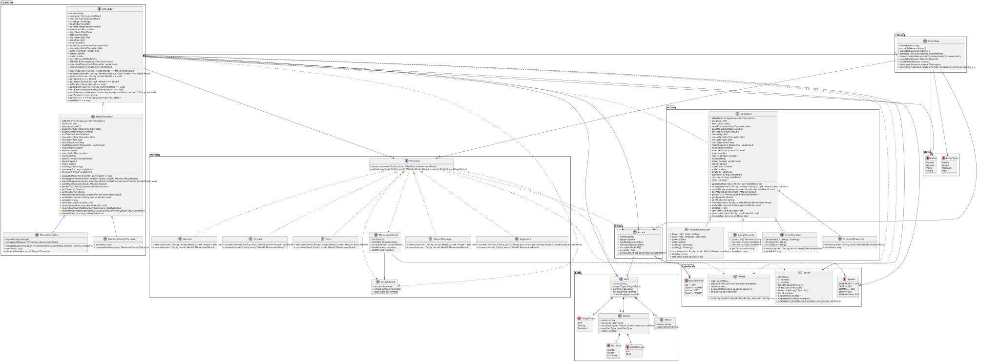
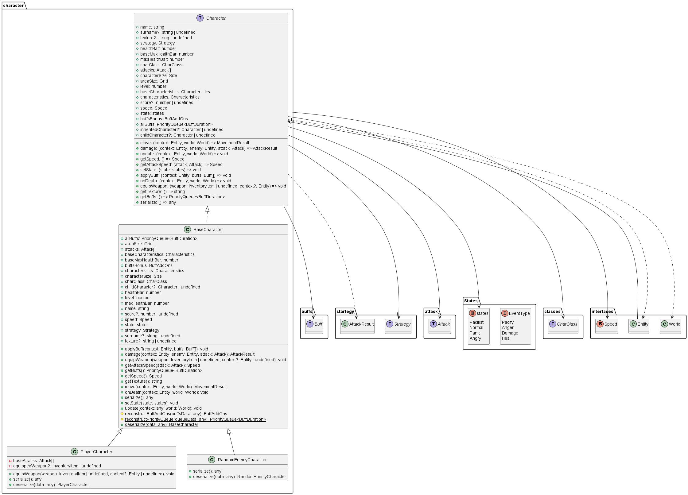
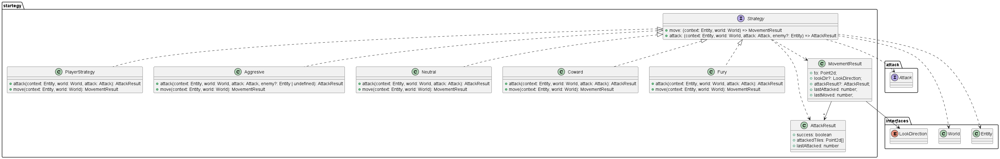
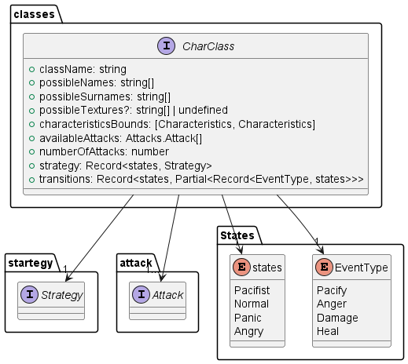
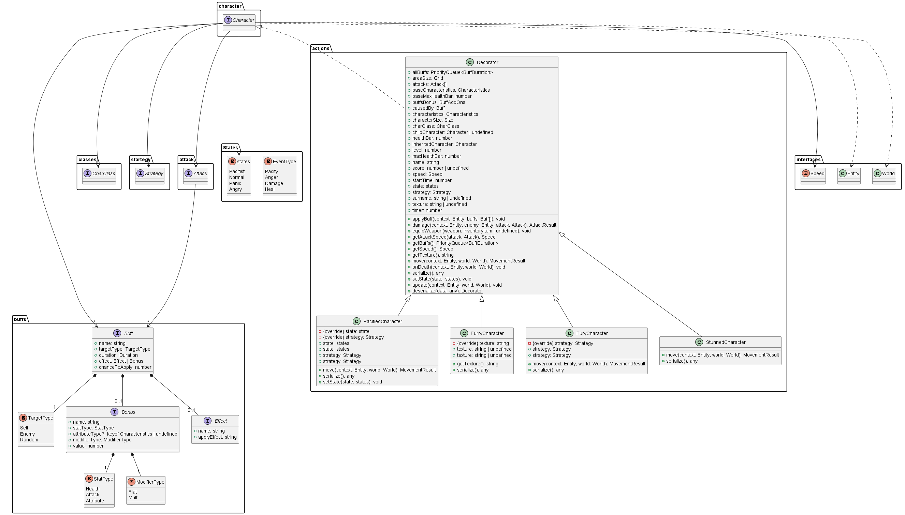
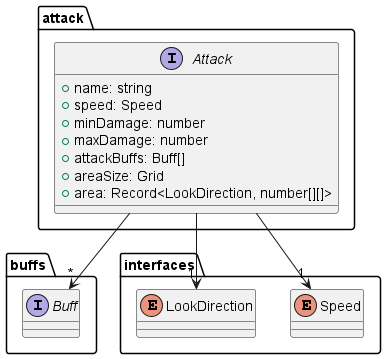
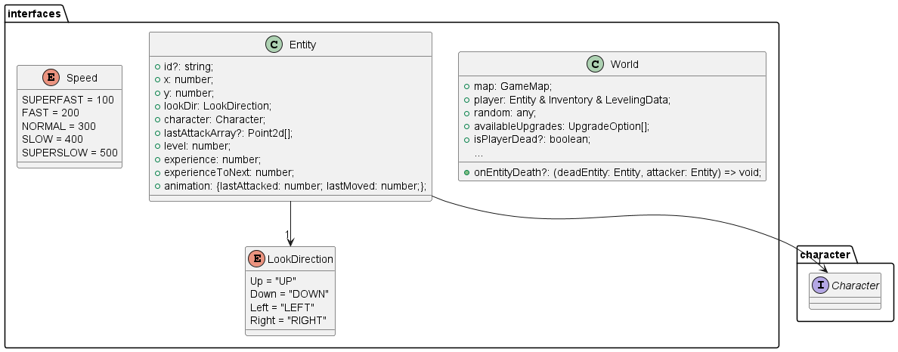

# Диаграммы

## Use Case (роли и случаи использования)

В соответствии с этой диаграммой, есть лишь одна роль пользователей - Игрок, и этой роли доступны следующие случаи использования системы:

- Игрок может создать карту для игры (как сгенерировать автоматически, так и загрузить вручную)
- Игрок может перемещаться по текущей локации и между локациями
- Игрок может убивать монстров и повышать свой уровень
- Повышая свой уровень игрок может прокачиваться, повышая свои характеристики
- Игрок может использовать предметы, повышая свои характеристики

## Диаграмма компонентов

Эта диаграмма демонстрирует верхнеуровневую организацию системы в соответствии с ее описанием из [BASE.md](BASE.md). Сплошными линиями показаны взаимодействия компонентов друг с другом, пунктирными стрелками - зависимости одних от других (на момент написания этого текста и создания этих диаграмм не все компоненты еще реализованы, и диаграмма еще может уточняться).

## Диаграмма классов

Так как не все приложение выполнено в стиле ООП, целиком к нему эта диаграмма оказалась неприменима. Здесь показана та его (готовая) часть, которую удалось соответствующим образом описать:

Диаграмму можно разделить на несколько смысловых блоков:

1. Персонаж - классы, определяющие интеллект существа, а также то, как откуда и как он получает свои характеристики.

3. Стратегии поведения - классы, определяющие поведение героя.

3. Классы персонажей - классы, определяющие то, откуда сгенерированному персонажу брать свои первичные характеристики.

4. Баффы героя, касающиеся изменения его поведения

5. Атаки - классы, которыми можно охарактеризовать проводимую атаку (по типу радиуса действия, накладываемых бафов и т.д).

Система также взаимодействует с классами World, определяющим игровой мир, и Entity - интерактивный объект в игровом мире.

## Диаграмма последовательностей

На этой диаграмме показаны последовательности трех самых главных механик игры (на момент написания этого текста и создания этих диаграмм не все побочные механики еще реализованы, и некоторые еще будут изменяться):

- Загрузка игры
- Движение персонажа
- Атака

## Диаграмма конечных автоматов

На этой диаграмме показана диаграмма состояний frontend части данного приложения, т.к. она лучше остальных описывается в терминах конечных автоматов (на момент написания этого текста и создания этих диаграмм не все механики еще реализованы, поэтому и эта диаграмма может в будущем измениться).
